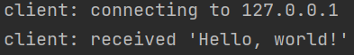

# Simple-Stream

ID1 : 206795841
ID2 : 209011840

#Complie instruction :

    

    Server:
    make server
    ./server
    
    Original_server:
    make original_server
    ./original_server
    
    compile both files:
    make all
    
    remove all project compiled files:
    make clean

 

#Execute instruction :

    
    - Run the server
    - Execute the command "./client localhost"

